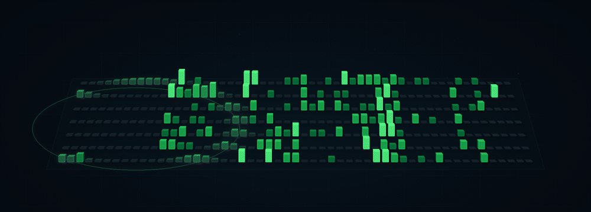

<h1 align="center">Hi 👋, I'm Computboy</h1>

  <b>Industrial Design × Computer Graphics × AI</b> 
  Building at the <b>graphic computing systems and human‑AI co‑creation</b>.

  

---

### 🎨 Current Focus

- **Advanced Rendering & Visual Computing** — rendering techniques, graphics algorithms, and visual computing.
- **Mobile Real-time SRFG** — efficient visual enhancement for mobile platforms
- **Real-time Computer Graphics** — OpenGL / GLSL, rendering pipelines, simulation
- **Human–AI CoDesign** — interaction tools for design education and creative workflows

### 🧩 Selected Work

- **CoDesign Agent** — a human–AI collaborative workspace for design education, built with SwiftUI
- **NPR Shader Library** — reusable components for a wide variety of non‑photorealistic rendering styles
- **Graphics Experiments** — OpenGL rendering, particle simulation and differentiable rendering explorations

### 🚀 Contribution Pulse

  

---

  <i>Designing systems. Rendering ideas.</i>

